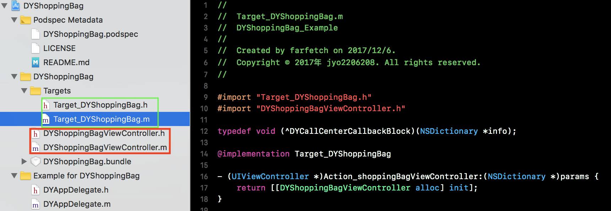

FFCallCenter
==============

FFCallCenter是一款用于工程组件化之后各个模块之间相互通讯的库。

工程组件化之后组件间通讯的痛点
==============
1. 传统的组件化为了彻底解耦，中间件不得不维护一份巨大的字符串和数据之间的mapping表，这份mapping表随着单例的中间件一起常驻于内存中带来性能问题，同时对于开发人员来说找到一个正确的key来获取数据将会持续成为头疼的点。
#####Example:
>PLP boy: 我发现我无法正确从中间件获取到shoppingBagViewController。我调试了一整天最后才发现原来是中间件维护的mapping表关于这个对象的key值被设成了@"shoping"而不是@"shopping"。少了个"p"。

2. 如果没有合理的组件间通信机制而只有router的话，对于跳转以外的数据通讯我们很难控制。想象一下，shoppingBag有个bag.png的图片，这图片原先在工程里所有人都可以随意访问的时候大家只要[UIImage imageNamed:@"bag"]就能拿到了。但组件化之后图片八成是需要放在shoppingBag的业务模块中的。那这个时候如果主页、PLP、PDP等页面需要显示这个图片就很难处理了。（把图片放在所有组件或者主工程中并不好玩）。

3. 如果单纯的只是把业务模块当做一个pod library拆出来而不做任何组件间通讯的机制的话，业务模块间只能说是名义上的解耦，实际上各自之间还是相互耦合。我猜你不会想见到像下面这样的teamwork。
#####Example:
>PLP boy: 我今天无法完成这个和PDP相关的功能，因为PDP boy还没完成。我需要等待他的完成才能继续做。
>
>PDP boy: 我也很无奈啊，大部分我都做完了，但是我还在等待CheckOut 和ShoppingBag。
>
>checkOut boy: 还需要等待一周
>
>ShoppingBag boy: 还需要等待两周


FFCallCenter的特点
==============
1. 利用OC的runtime机制，无需管理mapping表。无需知道key值，使用更方便。
2. 灵活的target action机制可以处理几乎所有的业务模块间通讯，不仅仅于跳转。
3. 彻底解决模块间的依赖。不用让各个业务模块的负责人互相等待。你甚至可以在所依赖的业务模块完全不存在的时候进行平行开发。
4. 有专门对外公开的target区别于业务代码，对业务侵入少

模块化之前
==============
除了mainProject外所有方块都是一个pop library。  
红色的为业务模块。可以看到各业务模块之间会根据业务需求或多或少有横向依赖。


模块化之后
==============
除了mainProject外所有方块都是一个pop library。  
红色的为业务模块。  
FFCallCenter为业务模块间通讯组件。  
XXXHeader包含了各业务模块专用的FFCallCenter的category。用于开放自身数据的接口。


使用
==============
1. FFCallCenter要求各业务模块首先提供一个或多个以`Target_`开头的类将各自需要开放的数据通过`Action_`开头的方法提供出来


2. 各业务模块的开发人员同时还需要提供一个Header库。这个库提供针对业务的FFCallCenter的category类。这个库需要依赖FFCallCenter。通过调用下面这个方法将对应的targetName和actionName，系统即可通过runtime获取到对应业务模块公开的数据。


```objc
- (id)performTarget:(NSString *)targetName action:(NSString *)actionName params:(NSDictionary *)params shouldCacheTarget:(BOOL)shouldCacheTarget;
```


3. 当某个业务模块需要使用另一个业务模块的数据的时候需要先引入对应业务模块的Header库，然后调用事先定义在header中的方法即可。如下

```objc
[self presentViewController:[[FFCallCenter sharedInstance] shoppingBagViewController] animated:YES completion:nil];
```

Enjoy!
==============

