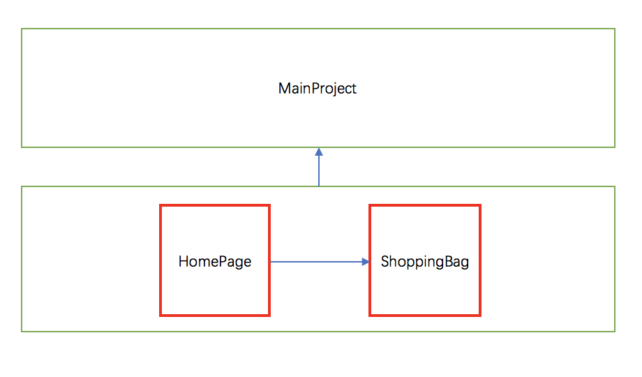
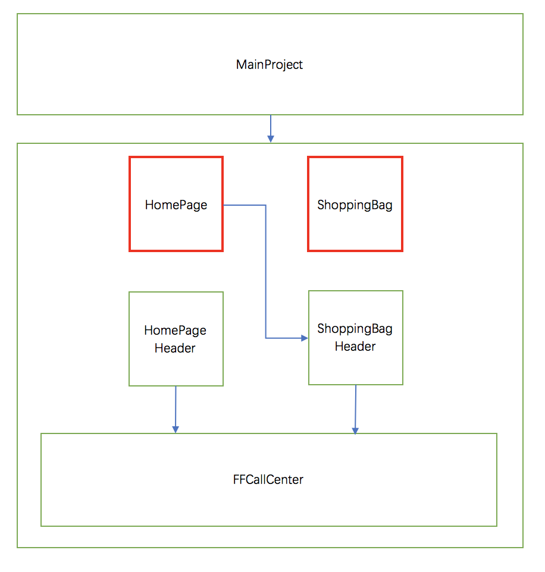
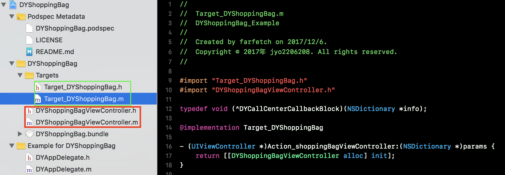
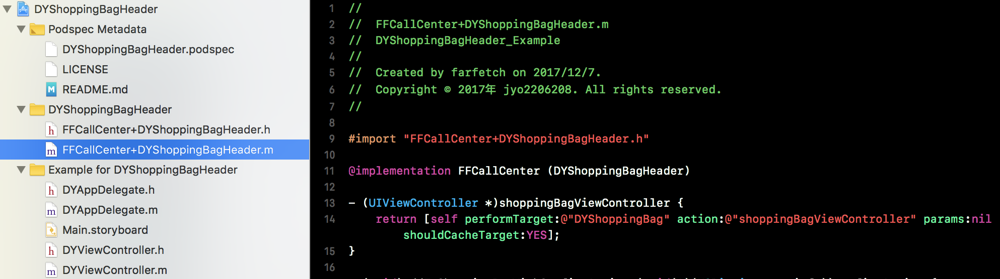

FFCallCenter
==============

[**中文说明**](Docs/README_cn.md)

FFCallCenter is a pod library for communication between each componets after Modularization as a mediator.

The Pain point after Modularization
==============
1. The most simple way to decoupling in Modularization is to maintain a big mapping table in mediator.The mapping table contain a string as a Key and a value for use(for example a UIViewController).This mapping table will stay in memory with the mediator all time, and that may cause a bad performance.And it is also a problem for a developer to find a 
correct key to get data.
#####Example:
>PLP boy: I can't get the `shoppingBagViewController` from the mediator. I debugged the whole day and finally found the problem, the key in the mapping table is defined as @"shoping", it missed a "p". 

2. If there is no mediator for communication between each componets but only router, it will be very difficult to control the data communication except the navigation. Imagine that shoppingBag has a picture of bag.png, which was available in MainProject and everyone can visit it, you can get it very easy just like [UIImage imageNamed:@ "bag"]. But after the shoppingBag component splited . If PLP, PDP and other component need to display the picture, it will be very difficult. (it is not fun to put pictures in all components or main projects).

3. If the Modularization without a mediator for communication between each componets,
each componet is nominal decoupling only, and in fact they are coupled with each other. I guess you don't want to see a teamwork like this.↓
#####Example:
>PLP boy: I can't finish this PDP - based feature today, because PDP boy is not finished yet. I need to wait for his completion to continue.
>
>PDP boy: I'm also very helpless. I've done most of it, but I'm still waiting for CheckOut and ShoppingBag.
>
>checkOut boy: It still takes one week to wait.
>
>ShoppingBag boy: It still takes two week to wait.

The advantages of FFCallCenter
==============
1. Using the runtime of OC, no need to manage the mapping table. no need to know the key value, easy to use.
2. The target action mechanism can handle almost all of the communications of business component, not only navigation.
3. Resolve the dependency between components. You don't have to wait for the completion of other business component. You can even do parallel development while the business components is not exist.
4. There is a special public target that is different from the business code and is less intrusive to the business.

befor Modularization
==============
* All the squares is a pod library except mainProject.  
* The red is the business component.  
* You can see that the business component are more or less dependent on another business component.



after Modularization
==============
* All the squares is a pod library except mainProject.  
* The red is the business component. 
* FFCallCenter is a pod library for communication between each componets as a mediator.  
* XXXHeader contains the category of the FFCallCenter that is dedicated to the business components.As An interface for opening up its own data.
* No dependences in each business component.


usage
==============
1. FFCallCenter requires that each business componet need to provide one or more classes start with `Target_`, and function that needs opening data to start with `Action_`.


2. The developers of each business component also need to provide a Header library. This library provides the category class for the FFCallCenter for the business.This library needs to dependent on FFCallCenter.By calling the following method using corresponding targetName and actionName, the FFCallCenter can return the data which is prepared by the business component through runtime.

```objc
- (id)performTarget:(NSString *)targetName action:(NSString *)actionName params:(NSDictionary *)params shouldCacheTarget:(BOOL)shouldCacheTarget;
```

  
3. When a business component needs data from another business component, it is necessary to import the Header Library of the corresponding business components, then invoke the method that is defined in header before. Like this↓

```objc
[self presentViewController:[[FFCallCenter sharedInstance] shoppingBagViewController] animated:YES completion:nil];
```

Enjoy!
==============

